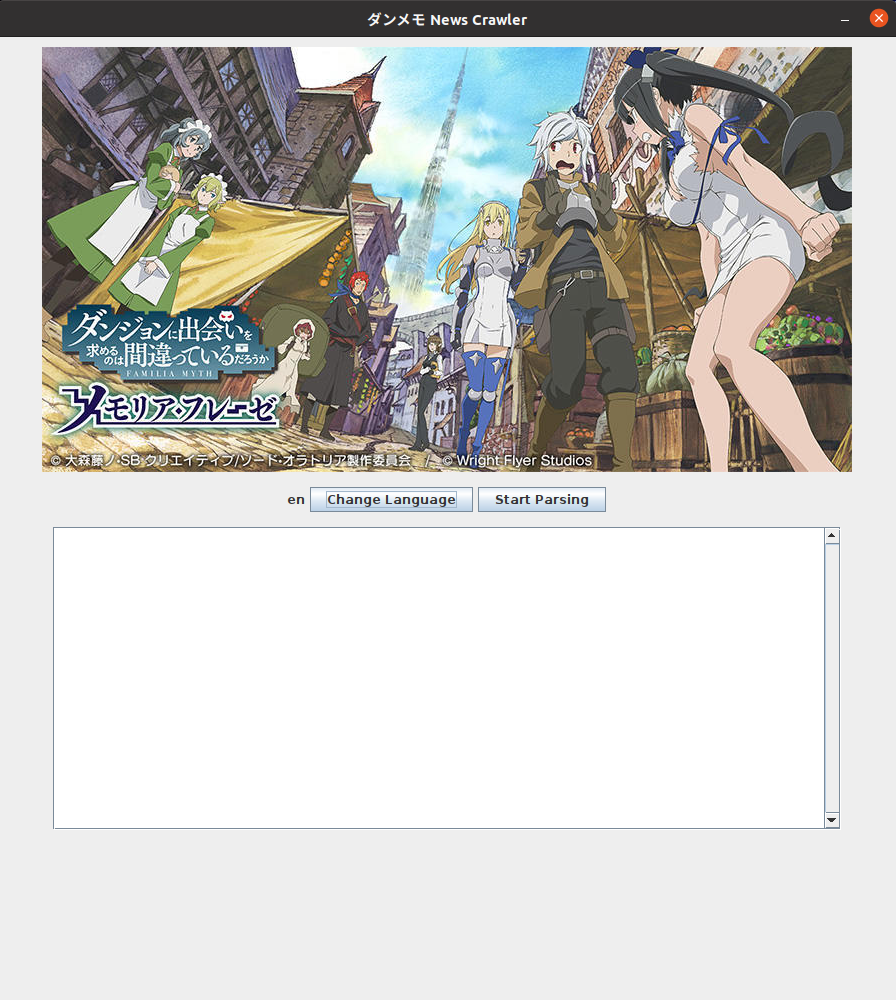
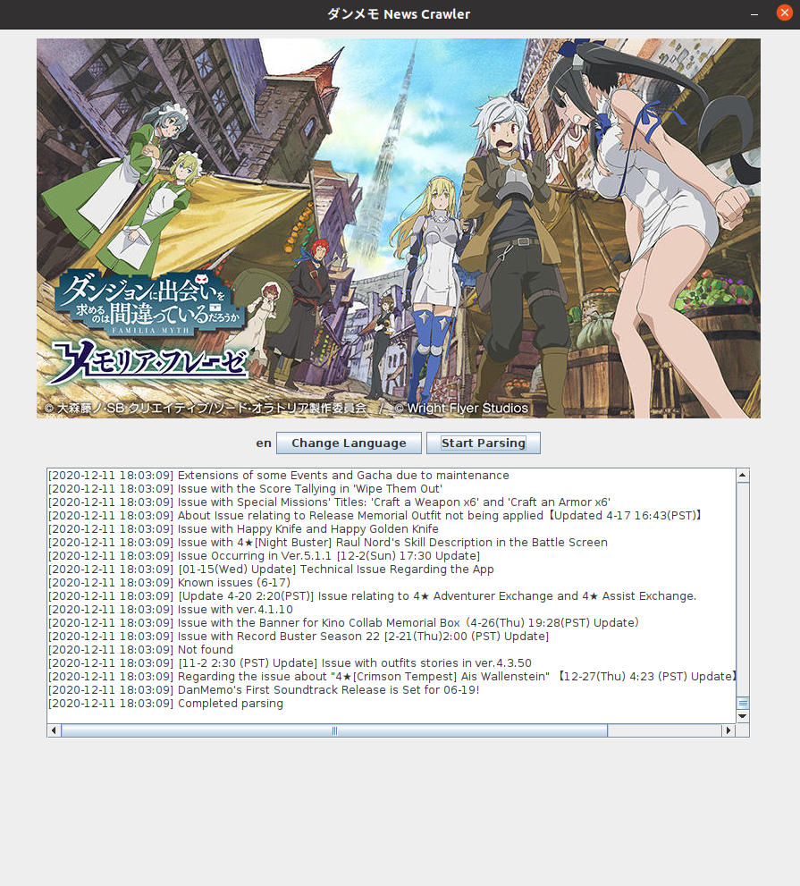
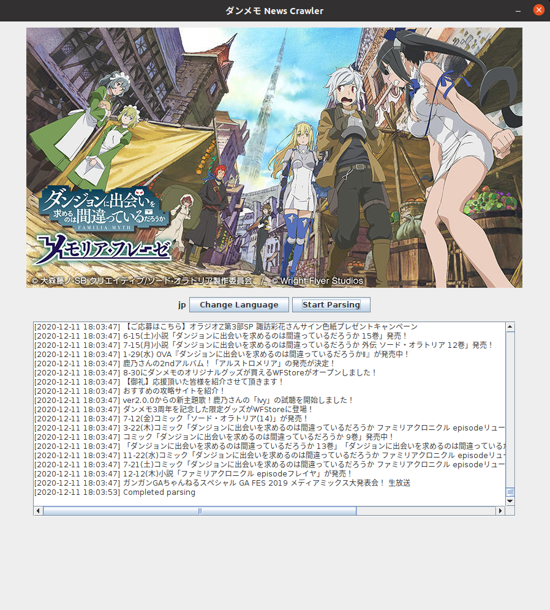

# DanMachi - MEMORIA FREESE News Crawler

Simple Java application to crawl and store in-game news for the DanMachi - MEMORIA FREESE mobile game.


## Features
- [x] Recursive crawler to identify and store html pages within each category of news (News, DanMachi Info, Update, Malfunction)
- [x] Local storage for images/css/js instead of referencing to CDN
- [x] Storing of parsed sites for quicker parsing
- [x] Crawls both EN/JP API
- [x] GUI for users

## Screenshots






## Caveats
- Checking of top-level .html files are based on the stored sites.txt

## Environment
This Java crawler application is written under the following environment:
- OpenJDK 11.0.9.1
- jsoup 1.12.1


## Compiling and running
Manually compiling .java files:
```shell
javac -cp ../lib/*.jar *.java
```

To run:
```shell
java -cp ".:../lib/*" Crawler
```

To compile into a .jar:
```shell
jar -cvfe Crawler.jar Crawler ./ 
```

Or if you're on Linux, simply run the shell script in the src directory with:
```shell
./run.sh
```

## Licensing
This project is licensed under the MIT License - see the LICENSE.txt file for details.
